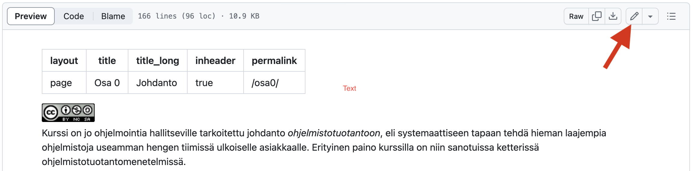
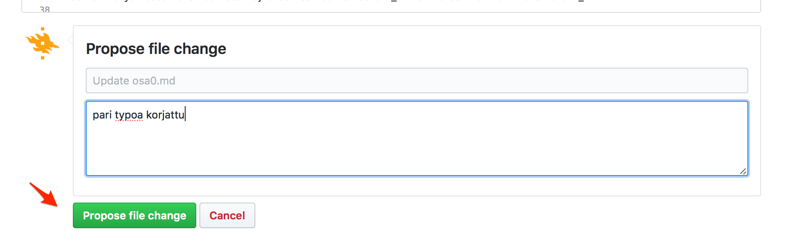
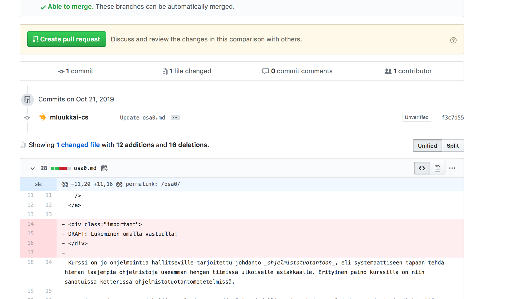
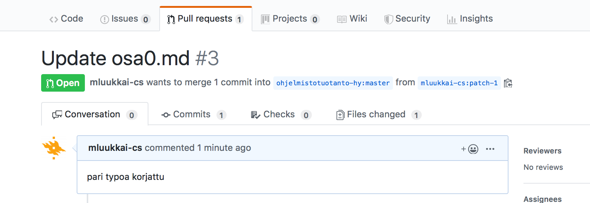

Kurssi on jo ohjelmointia hallitseville tarkoitettu johdanto _ohjelmistotuotantoon_, eli systemaattiseen tapaan tehdä hieman laajempia ohjelmistoja useamman hengen tiimissä ulkoiselle asiakkaalle. Erityinen paino kurssilla on niin sanotuissa ketterissä ohjelmistotuotantomenetelmissä.

Opintojakso käytyäsi ymmärtät ohjelmiston elinkaareen liittyvän käsitteistön ja osaat soveltaa ohjelmistotuotannon menetelmällisiä periaatteita ja käytänteitä (esim. Scrum) työskentelyssäsi. Tarkemmin ottaen

- tunnet ohjelmistotuotannon, erityisesti ketterän ohjelmistotuotannon vaiheet,
- tiedät miten vaatimuksia hallitaan ketterässä ohjelmistotuotannossa,
- ymmärrät suunnittelun, toteutuksen ja testauksen vastuut ja luonteen ketterässä ohjelmistotuotannossa,
- ymmärrät ohjelmiston laadunhallinnan perusteet,
- tunnistat ohjelmistokehityksen taloudelliset reunaehdot, sekä
- osaat toimia ympäristössä, jossa ohjelmistokehitys tapahtuu hallitusti ja toistettavalla tavalla.

## Kurssin suorittaminen ja arvostelu

Kurssi koostuu kolmesta komponentista, luennoista, laskuharjoituksista ja miniprojektista.

### Luennot

Kurssilla on 11 luentoa sekä useampi vierailuluento. Luennoilla käydään pääasiassa läpi ohjelmistotuotantoon liittyvää käsitteistöä ja teoriaa, samaa asiaa mihin tämä materiaali keskittyy.

### Laskuharjoitukset

Kurssiin liittyy viikoittaiset laskuharjoitukset. Tehtäviä harjoituksissa on kahden tyyppisiä.

Luennoilla ja tässä materiaalissa käytävää teoriaa kertaavat _viikoittaiset_ tehtävien (monivalintoja tai lyhyitä pohdintatehtäviä) deadline on sunnuntaina klo 23.59.
Toinen osa tehtävistä käsittelee ohjelmistotuotantoon liittyviä teknisempiä asioita, kuten versionhallintaa, testaamista ja ohjelmistojen konfigurointia, näiden deadline on _maanantaina klo 23:59_. Tehtävien ohjelmointikieli on Python.

Laskuharjoitusten oletettu kuormittavuus on ensimmäisen kolmen viikon aikana enemmän ja tämän jälkeen vähemmän. Teoriatehtäviin vastaaminen on suhteellisen nopeaa, mutta järkevästi vastaaminen edellyttää osallistumista luennoille ja/tai viikon materiaalin lukemista.

### Apua laskuharjoituksiin

Kurssilla on oma Discord kanava, jossa voit keskustella esimerkiksi tehtävistä: TODO

Kurssin discord kanava sijaitsee muutaman muun kurssin kanssa samalla palvelimella: <https://discord.gg/Fd5Bq36V6U>

Lisäksi apua tehtävien tekoon saa [Koodaamosta](https://tim.pm/Koodaamo), Agoran Latin tietokoneluokka (Ag B112.2) tiistaisin, torstaisin ja perjantaisin klo 12:00-14:00. Kurssin oma assistentti on paikalla perjantaisin, mutta Koodaamoon saa osallistua muinakin aikoina. 

Lisäksi Ohjelmistotuotanto kurssin opiskelijat voivat osallistua [ohjelmistotestaus](https://opencs.it.jyu.fi/software-testing/) kurssin kanssa yhteisiin harjoituksiin maanantaisin ja torstaisin 9:15-10:45 luokassa C331.3.

Ryhmiin osallistuminen on vapaaehtoista ja niihin voi tulla tekemään tehtäviä ja kysymään apua opettajilta. Tehtävien tekemiseen ei tarjota sähköpostineuvontaa.

### Miniprojekti

Kurssin loppupuolella järjestetään _miniprojekti_, eli ryhmässä tehtävä pieni harjoitustyö, jonka pääasiallisena tarkoituksena on projektinhallinnan sekä eräiden laadunhallintatekniikoiden harjoittelu.

Kukin miniprojektiryhmä koostuu 4-6 opiskelijasta, ryhmillä on myös asiakas, jota ryhmä tapaa viikoittain. Ensimmäisellä viikolla asiakastapaamiseen tulee varata 60 minuuttia, jälkimmäisillä 30 minuuttia.

Kurssin lopussa on miniprojektien yhteinen demotilaisuus.

Miniprojekteissa työskentelyyn tulee varata yhteensä noin 6 tuntia aikaa viikossa.

_Kurssin läpäisyn edellytyksenä_ on hyväksytysti suoritettu tai hyväksiluettu miniprojekti.

Miniprojektit tapaavat asiakasta kampuksella. Tarvittaessa tehdään yksi tai kaksi etäryhmää.

#### Miniprojektin hyväksilukeminen

Miniprojektiin osallistuminen ei ole välttämätöntä, jos sinulla on vähintään _kolmen kuukauden työkokemus_ ohjelmistokehitystiimissä toimimisesta. Jos hyväksiluet miniprojektin työkokemuksella, kerro asiasta emailitse (petri.j.ihantola@jyu.fi) siinä vaiheessa kun olet tehnyt ensimmäiset tehtävät (viikolla 2). Hyväksiluetuista projekteista järjestetään yhdelle (ajankohta sovitaan yhdessä opiskelijoiden kanssa) luentokerralle paneelikeskustelu, jossa työkokemusta saaneet opiskelijat pääsevät jakamaan kokemuksiaan. Kurssin opettaja juontaa paneelikeskustelun.

### Kurssin arvostelu

Kurssin eri osa-alueista saa pisteitä. Osa-alueiden painoarvot lopullisessa arvostelussa ovat:

- Monivalintatehtävät 10%
- konfigurointitehtävät 15%
- miniprojekti 25% pistettä
- koe 45%
- osallistuminen vierailulunennoille 5%

Läpipääsy edellyttää miniprojektin hyväksyttyä suoritusta (tai hyväksilukua) ja kokeen hyväksyttyä suorittamista.

### Luennot - laskuharjoitukset - miniprojekti

Kurssi siis sisältää kolme pääkomponenttia, luennot, viikoittaiset laskuharjoitukset sekä miniprojektin. Komponentit ovat luonteeltaan melko erilaisia, ja se on joskus aiheuttanut hämmennystä opiskelijoiden keskuudessa.

Kurssin luennoilla keskitytään pääosin ohjelmistokehityksen teoriaan ja käsitteistöön. Laskareista monivalintatehtävät liittyvät kunkin viikon luentoihin.

Versionhallintaa, ohjelmistojen konfigurointia, testausta ja ohjelmointia käsittelevien teknisempien tehtävien aihepiirejä ei taas luennoilla käsitellä oikeastaan ollenkaan (poislukien testaukseen liittyvä teoria).

Miniprojektin ideana taas on yhdistää luentojen teoria ja laskareissa käsitellyt teknisemmät asiat, ja soveltaa niitä käytännössä pienessä ohjelmistoprojektissa.

Kokeessa suurin paino tulee olemaan teoriassa ja sen soveltamisessa käytäntöön. Laskareiden teknisimpiä asioita, kuten versionhallintaa ei kokeessa tulla kysymään. Tarkemmin kokeesta ja siihen valmistautumisesta kurssin viimeisellä luennolla.

Kuten kohta tulemme näkemään, ohjelmistotuotanto kattaa suuren kirjon erilaisia asioita alkaen ihmisten johtamisesta aina teknisimpiin komentoriviltä suoritettaviin operaatioihin asti. Sama heijastuu myös kurssin rakenteessa, kurssilla on erihenkisiä komponentteja, näistä yksikään ei ole muita tärkeämpi, kullakin on oma painoarvonsa kurssin arvostelussa. Teoria-asioita arvioidaan koemenestyksen perusteella, käytännöllisimpiä asioita taas "jatkuvana arviona" laskareista kertyvien pisteiden ja miniprojektissa suoriutumisen perusteella.

## Aikataulu

{{#include ../includes/aikataulu.md:kaikki}}

## Typoja materiaalissa

Kun huomaat kurssimateriaalissa kirjoitusvirheitä, tee korjausehdotus. Kurssimateriaali on repositoriossa
[https://github.com/ohjelmistotuotanto-jyu/ohjelmistotuotanto-jyu.github.io](https://github.com/ohjelmistotuotanto-jyu/ohjelmistotuotanto-jyu.github.io) tiedostoissa [osa0.md](https://github.com/ohjelmistotuotanto-jyu/ohjelmistotuotanto-jyu.github.io/blob/master/osa0.md) jne.

Muutosehdotuksen tekeminen aloitetaan painamalla tiedoston _kynä-symbolia_:

Kun teksti on editoitu halutunkaltaiseksi, luodaan muutosehdotus sivun alalaidasta:

Tämän jälkeen vielä luodaan muutosehdotuksesta _pull request_

Kun kaikki klikkailu on tehty, syntyy materiaalirepositorioon pull request

Ja kun kurssihenkilökunta mergeää pull requestin, typo korjautuu materiaalista.
